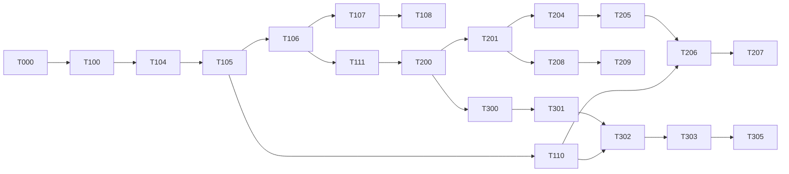

# IMPLEMENTATION PLAN

Status: PROPOSED. Phases = `docs/ai/ROADMAP.md`. This file breaks them into tasks Claude can do **one per session**.
Each task: ID · goal · touches · satisfies (FR/TR/SEC) · done-when. Never start the next task without it being set in `CURRENT_TASK.md`.

Definition of Done (every task): lint ✓ typecheck ✓ relevant tests ✓ build ✓ (when code) · RLS tests for new tables · audit for sensitive actions · docs updated · Changed/Validated/Remaining/Next reported.

---

## Phase 0 — Discovery (Day 0)
| ID | Task | Done when |
|---|---|---|
| T-000 | Inventory repo: versions, routes, Supabase, auth, tests, deploy config; run checks | `WORKSPACE_STATE.md` filled with evidence |
| T-001 | Write ADR-001…008 (TRD §16) | ADRs merged |
| T-002 | Answer PRD open decisions D1–D3 with owner | Decisions recorded |

Phase 0 status (2026-10-10): T-000 DONE (evidence: `docs/ai/WORKSPACE_STATE.md`) · T-001 stubs only, all
`Decision: PENDING`, uncommitted · T-002 PARTIAL (D1 answered: SaaS, multi-tenant foundation — PRD §10; D2–D3 open, needed by R1/R2).

Day 0 findings that shape Phase 1 (verified — see `WORKSPACE_STATE.md`):
- Package manager is **npm**; scripts are `dev/build/start/lint` only. T-100 must add `typecheck`, `test`, `test:e2e`.
- TypeScript `strict` and ESLint (flat config, `eslint-config-next`) already exist and pass; T-100 extends them.
- No `src/`: code is in root `app/` with `@/*` → `./*`. T-100 decides/moves to `src/` (ADR-001) before modules are added.
- `npm audit` reports 5 high in the lint toolchain (ISSUE-002); T-100's audit gate needs a decision on it.
- `.gitignore` has `.env*` without `!.env.example` (ISSUE-003); fix in T-101.
- Supabase CLI not installed and no `supabase/` dir; prerequisite for T-104/T-105.
- Next.js 16.4.0: read `node_modules/next/dist/docs/` before T-103/T-104 (per `AGENTS.md`).

## Phase 1 — Foundation (R0) ~ Days 1–3
| ID | Task | Satisfies | Done when |
|---|---|---|---|
| T-100 | Strict TS, ESLint rules (`no-restricted-imports` for admin/provider SDKs, no `dangerouslySetInnerHTML`), Prettier, Vitest, Playwright, GitHub Actions skeleton | TR-001, SEC-D05 | CI green on empty app |
| T-101 | `lib/env` server/client Zod validation + `.env.example` | TR §14, SEC-C02 | Build fails on missing server var in prod mode |
| T-102 | Design tokens, `next-themes`, app shell (sidebar, topbar, ⌘K stub), base components (DataTable, StatusBadge, dialogs, toasts, skeleton, empty/error/forbidden) | Brief §3–5 | Light/dark/mobile screenshots; axe clean |
| T-103 | Security headers + CSP nonce, `poweredByHeader:false`, no browser source maps | SEC-D03, D06 | Header test passes |
| T-104 | Supabase clients (`server`, `client`, `admin`), session refresh proxy, login/logout/reset pages | TR-020, SEC-C03 | E2E login; no tokens in storage |
| T-105 | Migration 0001 (orgs, profiles, members, RBAC, invitations, audit) + seed permissions/system roles + pgTAP | TR-030..035, SEC-B07 | `supabase test db` green |
| T-106 | `withAction`/`withRoute` wrapper, errors, logger with redaction, correlation IDs, audit writer | TR-010..012, SEC-D04 | Unit tests |
| T-107 | Org resolution from slug, org switcher, invitation flow (FLOW-02) | FR-004, FR-006 | E2E invite → login |
| T-108 | MFA enroll/verify + `requireStepUp` | FR-002/003, SEC-B05 | Tests for aal1 block |
| T-109 | Rate limiter (shared store) on auth endpoints | SEC-B03 | Burst test |
| T-110 | Migration 0002 jobs/webhooks/idempotency + worker runner (cron route or Edge Function) | TR-042 | Job retried & dead-lettered in test |
| T-111 | Security test harness: tenant A/B fixtures, BOLA test helpers | SEC-B01 | Harness used by ≥1 test |

**Gate R0:** SEC-B01..B08, C02, C03 TESTED.

## Phase 2 — Infrastructure MVP (R1) ~ Days 4–10
| ID | Task | Done when |
|---|---|---|
| T-200 | Clients (minimal CRUD) | RLS + BOLA tests |
| T-201 | Provider accounts + encrypted credentials + connection test UI (FLOW-15) | Tamper test, SEC-C05 |
| T-202 | Domains CRUD + expiry chips + list filters (FLOW-04) | Tests + audit |
| T-203 | Expiry alert job (30/14/7/1 days) → notifications | Job test |
| T-204 | `DnsProvider` interface + Cloudflare adapter (read) + zone sync job | Adapter contract tests (mocked) + staging read |
| T-205 | DNS change request: validate, diff, risk, preview UI (FLOW-05 part 1) | Validation tests per type |
| T-206 | Apply job + read-back + uncertain reconciliation + snapshots (part 2) | Timeout scenario test |
| T-207 | HIGH-risk step-up + typed confirm + approval option | SEC-B09 |
| T-208 | Hosting accounts, websites, environments, website↔domain mapping (FLOW-06) | RLS tests |
| T-209 | Health checks via `safeFetch` (HTTP/SSL/DNS) | SEC-A06 tests |
| T-210 | Deployment records from Vercel adapter (read) | Staging verify |
| T-211 | Dashboard widgets (real data only) | Empty states correct |

**Gate R1:** domain/DNS BOLA + destructive-change tests VERIFIED on staging with a test zone.

## Phase 3 — Payments (R2) ~ Days 11–16
| T-300 | Payment schema 0004 + transition trigger + RLS | pgTAP |
| T-301 | `PaymentProvider` interface + Stripe adapter (Checkout Session/Payment Link per D3) | Stripe test mode |
| T-302 | Create-request action + outbox job + provider picker (FLOW-08) | Idempotency double-click test |
| T-303 | Stripe webhook route: raw body, verify, dedupe, process job | SEC-D02 forged/replay tests |
| T-304 | Dojo adapter + webhook (verify against current docs) | Sandbox verified |
| T-305 | Reconciliation cron | Missed-webhook test |
| T-306 | Refunds with step-up + approval (FLOW-09) | SEC-B09 |
| T-307 | Invoices + link to tickets/clients; email link via EmailProvider | E2E |

## Phase 4 — Operations (R3) ~ Days 17–21
T-400 CRM detail & contacts · T-401 projects · T-402 tasks + assignment (FLOW-10) · T-403 task updates/reports + manager workload · T-404 approvals engine · T-405 support tickets + internal notes (FLOW-11) · T-406 ticket→task / ticket→payment · T-407 customer portal (FLOW-16) + customer isolation suite · T-408 attachments with SEC-A05.

## Phase 5 — Team (R4) ~ Days 22–27
T-500 staff mgmt + offboarding (FLOW-03) · T-501 chat schema + RLS + realtime private channels · T-502 chat UI, mentions, read state, attachments · T-503 presence/typing · T-504 WebRTC 1-to-1 + TURN creds endpoint (FLOW-13) · T-505 employees/HR records · T-506 salary periods/entries/paid marking (FLOW-14) + salary access suite · T-507 expenses, leave.

## Phase 6 — Hardening (R5) ~ Days 28–30
T-600 GitHub/Vercel/Cloudflare/cPanel write ops (capability-verified) · T-601 monitoring (Sentry, health, queue lag alerts) · T-602 incidents · T-603 reports/exports (SEC-A08) · T-604 backup + restore drill to staging · T-605 full security checklist pass · T-606 accessibility + performance audit · T-607 production release (PRODUCTION_READINESS §33).

## Phase 9 — AI Website Builder
Not authorized. See `docs/product/AI_WEBSITE_BUILDER_SPEC.md`.

---

## Dependency graph (critical path)

## Risk register (plan-level)
| Risk | Mitigation |
|---|---|
| Dojo API capability differs from assumption | T-304 starts with a doc/sandbox spike; Stripe ships first |
| Registrar has no usable API | Domain records stay manual; DNS via Cloudflare |
| Serverless time limits for jobs | Worker via Supabase Cron + Edge Function or Vercel Cron batches; jobs short and idempotent |
| Scope creep (chat/HR early) | `CURRENT_TASK.md` single-task rule |
