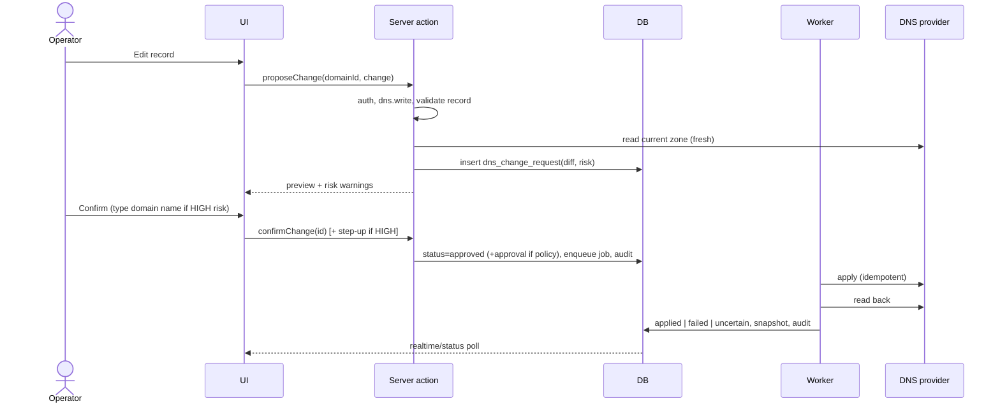
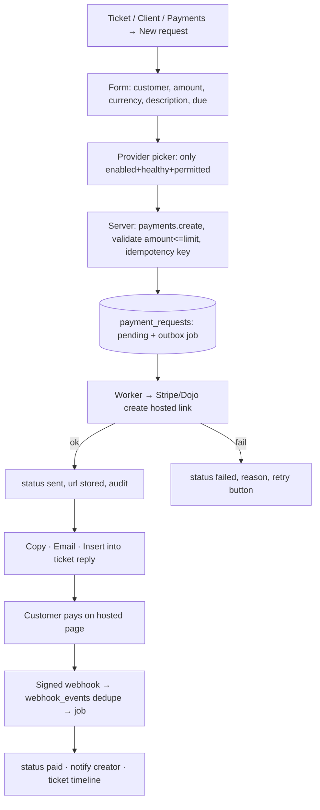

# APP FLOW — User journeys, screens and server behaviour

Status: PROPOSED. Each flow lists **Actor → Screens → Steps → Server checks → States → Failure paths**.
Routes use `/[org]/…` = `(dashboard)/[orgSlug]/…`; org slug is re-verified server-side on every request.

---

## 0. Global navigation map

```mermaid
flowchart LR
  L[/login/] --> M{MFA enrolled?}
  M -- required & no --> E[/mfa/enroll/]
  M -- yes --> V[/mfa/verify/]
  M -- not required --> O
  E --> O{orgs?}
  V --> O
  O -- 0 --> N[/onboarding: create or await invite/]
  O -- 1 --> D[/[org]/dashboard/]
  O -- many --> S[/select-org/] --> D
  D --> INF[Infrastructure: domains · dns · hosting · websites · deployments]
  D --> FIN[Finance: payments · invoices]
  D --> WRK[Workspace: clients · projects · tasks · support]
  D --> TEAM[Team: staff · hr · salary]
  D --> COM[Chat · calls · notifications]
  D --> SYS[Integrations · audit · settings]
  C[Customer login] --> P[/portal/: tickets · invoices · payments · websites/]
```

Sidebar items render only for permissions the server returned; direct URL access still re-checks.

---

## FLOW-01 Sign in
1. `/login` email + password → `signInWithPassword` (rate-limited per IP/email).
2. If role requires MFA and `aal1` → `/mfa/verify` (TOTP) → `aal2`.
3. Resolve memberships (active only). Disabled/suspended → generic "Account unavailable".
- Failures: wrong creds → generic error (no "user exists" leak); 5 failures → cooldown; expired session → back to `/login?next=`. `next` must be same-origin path.

## FLOW-02 Invite & onboard staff
Admin `/[org]/staff` → **Invite** (email, role(s)) → `staff.manage` + step-up if role is privileged → `invitations` row (hashed token, 7-day expiry) → email.
Invitee `/invite/[token]` → set password → MFA enroll if required → membership `active` → audit.
- Failures: expired/used token → "Ask your admin to resend"; email mismatch → reject.

## FLOW-03 Offboard staff
`/[org]/staff/[id]` → **Offboard** wizard: (1) reassign open tasks/tickets/clients (required), (2) review credentials they created, (3) confirm → step-up → membership `disabled`, global sign-out, audit, notify managers.
- Historical records keep `actor_user_id`; name shown as "(former staff)".

## FLOW-04 Add a domain
`/[org]/domains` → **Add domain** drawer: name, client, registrar, DNS provider account, expiry, auto-renew.
Server: `domains.create` → normalize (lowercase, punycode) → unique per org → insert → if DNS provider connected, enqueue `dns.sync_zone` job → audit.
States: list shows `Syncing…` badge until job done; then record count. Expiry badge colour by days left.

## FLOW-05 Change a DNS record (critical flow)

Risk HIGH = NS, MX, CAA, apex A/AAAA/CNAME, TXT matching `v=spf1|v=DKIM1|v=DMARC1`.
- Failures: provider timeout → `uncertain` → reconciliation job reads provider and resolves. Never show "Saved" before read-back.

## FLOW-06 Website & environments
`/[org]/websites/new` → name, client, repo (optional), hosting account, environments (dev/staging/prod), domains map.
Website detail tabs: Overview (health) · Environments · Domains · Deployments · Activity.

## FLOW-07 Production deployment
Website → Deployments → **Deploy to production** → choose commit/branch → `deployments.create` + step-up (+ approval if policy) → job calls provider → status polled/webhooked → health check → `success`/`failed`. Rollback = same flow pointing to previous deployment.

## FLOW-08 Create payment link (staff)

- UI copy: "Link created — awaiting payment". Redirect `?success` page says "We're confirming your payment".
- Provider down → option disabled with reason; no silent switch.

## FLOW-09 Refund
Payment detail → **Refund** (full/partial ≤ captured − refunded) → `payments.refund` + step-up (+ approval over threshold, approver ≠ requester) → job → provider → webhook confirms → `refunded`/`partially_refunded`.

## FLOW-10 Task assignment & report
Manager `/[org]/tasks/new` → title, description, client/website/project, assignee (server checks same org + active), reviewer, priority, due → notify assignee.
Assignee: `todo → in_progress` → **Add update** (done / blocked reason / next / minutes) → **Submit for review** → reviewer **Approve** / **Request changes** → `completed`/`in_progress`. Overdue job flags tasks daily.

## FLOW-11 Support ticket
Customer portal or email → ticket `open` → auto/ manual assign → agent reply (`visibility=customer`) or internal note (`internal`, yellow background, never in portal queries) → optional: create task, create payment link, escalate (manager notified, `escalated`) → resolve → customer confirm or auto-close after N days.

## FLOW-12 Chat
`/[org]/chat` three-pane: channel list · messages · details. Send → server inserts (membership check by RLS) → realtime to members. Attachment → signed upload URL → scan/validate → message references file. Leaving channel stops subscription and access to new messages.

## FLOW-13 1-to-1 call
Click call → server creates `calls` + participants (same org, `calls.use`) → private channel `call:<id>` → callee sees incoming modal (30 s timeout → `missed`) → accept → server returns short-lived TURN creds → SDP/ICE exchange → connected → end → duration stored. Device permission denied → explain how to enable.

## FLOW-14 Salary run
HR/Finance `/[org]/salary` → **New payroll period** → entries auto-created for active employees (amount from current salary record) → edit/adjust (audited) → submit → approver (≠ creator) approves → mark each paid (date, reference, optional proof file) with step-up → period `closed`. Employee sees only own payslip-style view if permitted.

## FLOW-15 Connect an integration
`/[org]/settings/integrations` → provider card → **Connect** → token/OAuth → server encrypts and stores → **connection test** (real read call) → `connected` or `error` with reason. Disconnect → revoke where API allows → delete ciphertext → audit.

## FLOW-16 Customer portal
`/portal` login (customer role, separate layout). Sees only `customer_users` linked client: tickets (customer-visible messages), invoices, payment requests (pay button → hosted link), websites status. No staff names beyond display name, no internal data.

---

## Standard screen states (apply to every screen)
| State | Rule |
|---|---|
| Loading | Skeleton matching final layout; no spinners for > 300 ms content |
| Empty | Explain + primary action (only if user has permission) |
| Error | Human message + retry + correlation ID |
| Forbidden | "You don't have access to this" — no data hints |
| Not found | Same component for missing and cross-tenant |
| Pending external | Neutral badge ("Awaiting provider"), never green |
| Destructive confirm | Names the object, states impact, typed confirmation for HIGH risk |
